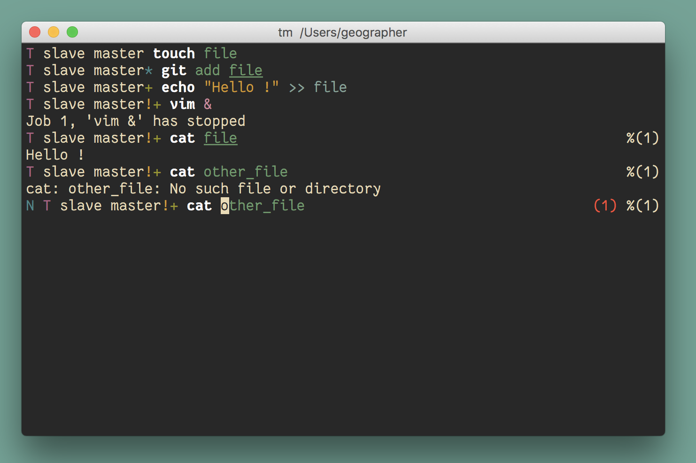

# Slave

Minimalistic but yet powerful prompt for fish shell.

## Features

  * Git tracking
  * Vi mode tracking
  * Jobs and errors tracking
  * Colorful environment

Slave is really light and shows informations only when you **need** to see
them. Slave should be able to run on any font or color configuration.

<p align="center">
  
</p>

[Click here for a demo video.](https://asciinema.org/a/132307)

## Installation

You can install Slave with [Fisherman](https://github.com/fisherman/fisherman).
Simply copy or type this in your terminal:

``` terminal
fisher add Oxyriser/slave
```

Slave is just a bunch of fish prompt functions so it can also be installed
manually.
